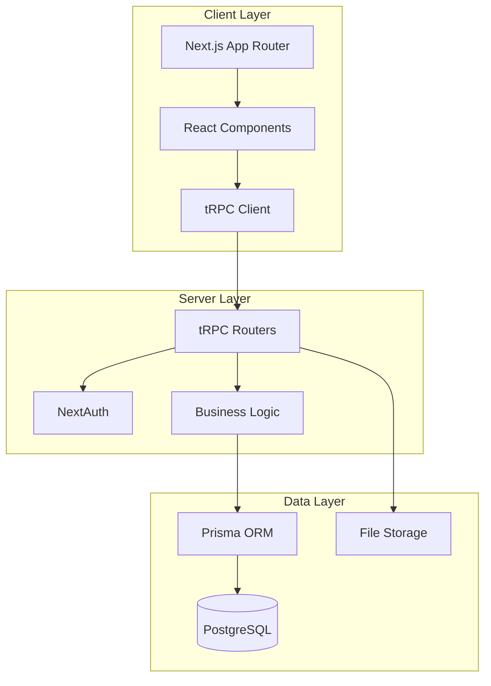

# Design Document

## Overview

The Expensify expense management system is built on the T3 stack (Next.js, TypeScript, Prisma, tRPC, NextAuth) to provide a type-safe, scalable solution for multi-organization expense management. The system emphasizes automated policy enforcement, streamlined approval workflows, and comprehensive audit trails while maintaining simplicity and performance.

## Architecture

### High-Level Architecture



### Technology Stack

- **Frontend**: Next.js 15 with App Router, React Server Components, Tailwind CSS
- **Backend**: tRPC with TypeScript for type-safe APIs
- **Database**: PostgreSQL with Prisma ORM
- **Authentication**: NextAuth 5.0 with email magic links
- **File Storage**: Local file system (expandable to cloud storage)
- **Testing**: Vitest with transactional testing
- **Validation**: Zod schemas for input validation

### Organization Context Management

The system uses **request-based organization scoping** rather than session-based scoping to support multiple browser tabs viewing different organizations simultaneously:

- **URL-based routing**: Organization context is determined from URL parameters (`/org/[orgId]/expenses`)
- **Input-based scoping**: All tRPC procedures require `organizationId` in their input schemas
- **Per-request validation**: Organization membership is verified on each request rather than stored in session
- **Multi-tab support**: Users can have multiple tabs open to different organizations without conflicts
- **Stateless design**: No organization state is stored in user sessions or browser storage

## Components and Interfaces

### Core Domain Models

#### Organization Management
```typescript
interface Organization {
  id: string;
  name: string;
  description?: string;
  createdAt: Date;
  updatedAt: Date;
  ownerId: string;
  settings: OrganizationSettings;
}

interface OrganizationMember {
  id: string;
  userId: string;
  organizationId: string;
  role: 'ADMIN' | 'MEMBER';
  joinedAt: Date;
  invitedBy?: string;
}

interface OrganizationInvitation {
  id: string;
  email: string;
  organizationId: string;
  role: 'ADMIN' | 'MEMBER';
  invitedBy: string;
  createdAt: Date;
  expiresAt?: Date;
}
```

#### Expense Management
```typescript
interface Expense {
  id: string;
  amount: number;
  description: string;
  date: Date;
  categoryId: string;
  userId: string;
  organizationId: string;
  status: ExpenseStatus;
  receiptUrl?: string;
  createdAt: Date;
  updatedAt: Date;
  approvedBy?: string;
  approvedAt?: Date;
  rejectionReason?: string;
}

type ExpenseStatus = 
  | 'DRAFT'
  | 'SUBMITTED' 
  | 'APPROVED' 
  | 'REJECTED' 
  | 'PROCESSING';

interface ExpenseCategory {
  id: string;
  name: string;
  description?: string;
  organizationId: string;
  policies: CategoryPolicy[];
  isActive: boolean;
}

interface CategoryPolicy {
  id: string;
  categoryId: string;
  maxAmount?: number;
  requiresApproval: boolean;
  autoApprove: boolean;
  approvalThreshold?: number;
  isActive: boolean;
}
```

### tRPC Router Structure

#### Organization Router
```typescript
export const organizationRouter = createTRPCRouter({
  // Organization CRUD
  create: protectedProcedure
    .input(createOrganizationSchema)
    .mutation(async ({ ctx, input }) => { /* Implementation */ }),
  
  listByUser: protectedProcedure
    .query(async ({ ctx }) => { /* Get user's organizations */ }),
  
  // organizationProcedure already includes organizationId validation
  getById: organizationProcedure
    .query(async ({ ctx, input }) => { /* Get organization details */ }),
  
  // Member management - extend base schema for additional fields
  listMembers: organizationProcedure
    .query(async ({ ctx, input }) => { /* Get org members */ }),
  
  removeMember: adminProcedure
    .input(organizationInputSchema.extend({ 
      userId: z.string().cuid() 
    }))
    .mutation(async ({ ctx, input }) => { /* Remove member from org */ }),
});
```

#### Invitation Router
```typescript
export const invitationRouter = createTRPCRouter({
  // Create invitations (admin only)
  create: adminProcedure
    .input(createInvitationSchema)
    .mutation(async ({ ctx, input }) => { /* Create invitation */ }),
  
  // List pending invitations for current user (user can accept these)
  listForUser: protectedProcedure
    .query(async ({ ctx }) => { /* Get pending invitations for logged-in user */ }),
  
  // List pending invitations for an organization (admin management)
  listByOrganization: adminProcedure
    .input(z.object({ organizationId: z.string() }))
    .query(async ({ ctx, input }) => { /* Get pending invitations for org */ }),
  
  // User actions
  accept: protectedProcedure
    .input(z.object({ invitationId: z.string() }))
    .mutation(async ({ ctx, input }) => { /* Accept invitation */ }),
  
  decline: protectedProcedure
    .input(z.object({ invitationId: z.string() }))
    .mutation(async ({ ctx, input }) => { /* Decline invitation */ }),
  
  // Admin actions
  cancel: adminProcedure
    .input(z.object({ invitationId: z.string() }))
    .mutation(async ({ ctx, input }) => { /* Cancel pending invitation */ }),
  
  resend: adminProcedure
    .input(z.object({ invitationId: z.string() }))
    .mutation(async ({ ctx, input }) => { /* Resend/refresh invitation */ }),
});
```

#### Expense Router
```typescript
export const expenseRouter = createTRPCRouter({
  // Expense CRUD - extend organization schema with expense fields
  create: organizationProcedure
    .input(organizationInputSchema.extend({
      amount: z.number().positive().max(100000),
      description: z.string().min(1).max(500),
      date: z.date().max(new Date()),
      categoryId: z.string().cuid(),
    }))
    .mutation(async ({ ctx, input }) => { /* Create and process expense */ }),
  
  listByUser: organizationProcedure
    .input(organizationInputSchema.extend({
      page: z.number().min(1).default(1),
      limit: z.number().min(1).max(100).default(20),
    }))
    .query(async ({ ctx, input }) => { /* Get user's expenses for this org */ }),
  
  listForReview: adminProcedure
    .query(async ({ ctx, input }) => { /* Get expenses needing review */ }),
  
  approve: adminProcedure
    .input(organizationInputSchema.extend({
      expenseId: z.string().cuid(),
      notes: z.string().optional(),
    }))
    .mutation(async ({ ctx, input }) => { /* Approve expense */ }),
  
  reject: adminProcedure
    .input(organizationInputSchema.extend({
      expenseId: z.string().cuid(),
      reason: z.string().min(1),
    }))
    .mutation(async ({ ctx, input }) => { /* Reject expense */ }),
  
  // File upload
  uploadReceipt: organizationProcedure
    .input(organizationInputSchema.extend({
      expenseId: z.string().cuid(),
      file: z.instanceof(File),
    }))
    .mutation(async ({ ctx, input }) => { /* Handle file upload */ }),
});
```

#### Category and Policy Router
```typescript
export const categoryRouter = createTRPCRouter({
  listByOrganization: organizationProcedure
    .query(async ({ ctx, input }) => { /* Get categories */ }),
  
  create: adminProcedure
    .input(organizationInputSchema.extend({
      name: z.string().min(1).max(100),
      description: z.string().optional(),
      maxAmount: z.number().positive().optional(),
      requiresApproval: z.boolean().default(false),
      autoApprove: z.boolean().default(false),
    }))
    .mutation(async ({ ctx, input }) => { /* Create category */ }),
  
  updatePolicies: adminProcedure
    .input(organizationInputSchema.extend({
      categoryId: z.string().cuid(),
      policies: z.array(z.object({
        maxAmount: z.number().positive().optional(),
        requiresApproval: z.boolean(),
        autoApprove: z.boolean(),
        approvalThreshold: z.number().positive().optional(),
      })),
    }))
    .mutation(async ({ ctx, input }) => { /* Update category policies */ }),
});
```

### Middleware and Context

#### tRPC Context
```typescript
export const createTRPCContext = async (opts: { headers: Headers }) => {
  const session = await auth();
  
  return {
    db,
    session,
    headers: opts.headers,
  };
};
```

#### Custom Procedures
```typescript
// Base organization input schema
const organizationInputSchema = z.object({
  organizationId: z.string().cuid(),
});

// Organization-scoped procedure - validates organization access
const organizationProcedure = protectedProcedure
  .input(organizationInputSchema)
  .use(async ({ ctx, next, input }) => {
    const { organizationId } = input;
    
    // Verify user has access to this organization
    const membership = await ctx.db.organizationMember.findFirst({
      where: {
        userId: ctx.session.user.id,
        organizationId,
      },
    });
    
    if (!membership) {
      throw new TRPCError({ code: 'FORBIDDEN' });
    }
    
    return next({ 
      ctx: { 
        ...ctx, 
        organizationId, 
        userRole: membership.role 
      } 
    });
  });

// Admin procedure - requires admin role in specified organization
const adminProcedure = organizationProcedure.use(async ({ ctx, next }) => {
  if (ctx.userRole !== 'ADMIN') {
    throw new TRPCError({ code: 'FORBIDDEN' });
  }
  
  return next({ ctx });
});
```

## Data Models

### Database Schema Design

```prisma
model User {
  id                    String   @id @default(cuid())
  email                 String   @unique
  name                  String?
  emailVerified         DateTime?
  image                 String?
  createdAt             DateTime @default(now())
  updatedAt             DateTime @updatedAt
  
  // Relations
  accounts              Account[]
  sessions              Session[]
  organizationMembers   OrganizationMember[]
  ownedOrganizations    Organization[]
  expenses              Expense[]
  invitationsSent       OrganizationInvitation[] @relation("InvitedBy")
  expenseApprovals      Expense[] @relation("ApprovedBy")
}

model Organization {
  id          String   @id @default(cuid())
  name        String
  description String?
  ownerId     String
  createdAt   DateTime @default(now())
  updatedAt   DateTime @updatedAt
  
  // Relations
  owner       User     @relation(fields: [ownerId], references: [id])
  members     OrganizationMember[]
  invitations OrganizationInvitation[]
  categories  ExpenseCategory[]
  expenses    Expense[]
  
  @@index([ownerId])
}

model OrganizationMember {
  id             String           @id @default(cuid())
  userId         String
  organizationId String
  role           OrganizationRole @default(MEMBER)
  joinedAt       DateTime         @default(now())
  invitedBy      String?
  
  // Relations
  user         User         @relation(fields: [userId], references: [id], onDelete: Cascade)
  organization Organization @relation(fields: [organizationId], references: [id], onDelete: Cascade)
  
  @@unique([userId, organizationId])
  @@index([organizationId])
}

model OrganizationInvitation {
  id             String           @id @default(cuid())
  email          String
  organizationId String
  role           OrganizationRole @default(MEMBER)
  invitedBy      String
  createdAt      DateTime         @default(now())
  expiresAt      DateTime?
  
  // Relations
  organization Organization @relation(fields: [organizationId], references: [id], onDelete: Cascade)
  inviter      User         @relation("InvitedBy", fields: [invitedBy], references: [id])
  
  @@unique([email, organizationId])
  @@index([email])
}

model ExpenseCategory {
  id             String    @id @default(cuid())
  name           String
  description    String?
  organizationId String
  isActive       Boolean   @default(true)
  createdAt      DateTime  @default(now())
  updatedAt      DateTime  @updatedAt
  
  // Relations
  organization Organization    @relation(fields: [organizationId], references: [id], onDelete: Cascade)
  policies     CategoryPolicy[]
  expenses     Expense[]
  
  @@unique([name, organizationId])
  @@index([organizationId])
}

model CategoryPolicy {
  id                String  @id @default(cuid())
  categoryId        String
  maxAmount         Decimal?
  requiresApproval  Boolean @default(false)
  autoApprove       Boolean @default(false)
  approvalThreshold Decimal?
  isActive          Boolean @default(true)
  createdAt         DateTime @default(now())
  updatedAt         DateTime @updatedAt
  
  // Relations
  category ExpenseCategory @relation(fields: [categoryId], references: [id], onDelete: Cascade)
  
  @@index([categoryId])
}

model Expense {
  id               String        @id @default(cuid())
  amount           Decimal
  description      String
  date             DateTime
  categoryId       String
  userId           String
  organizationId   String
  status           ExpenseStatus @default(SUBMITTED)
  receiptUrl       String?
  receiptFileName  String?
  approvedBy       String?
  approvedAt       DateTime?
  rejectionReason  String?
  createdAt        DateTime      @default(now())
  updatedAt        DateTime      @updatedAt
  
  // Relations
  category     ExpenseCategory @relation(fields: [categoryId], references: [id])
  user         User            @relation(fields: [userId], references: [id])
  organization Organization    @relation(fields: [organizationId], references: [id], onDelete: Cascade)
  approver     User?           @relation("ApprovedBy", fields: [approvedBy], references: [id])
  
  @@index([userId])
  @@index([organizationId])
  @@index([status])
  @@index([date])
}

enum OrganizationRole {
  ADMIN
  MEMBER
}

enum ExpenseStatus {
  DRAFT
  SUBMITTED
  APPROVED
  REJECTED
  PROCESSING
}
```

### Data Relationships

- **Users** can belong to multiple **Organizations** through **OrganizationMember**
- **Organizations** have multiple **ExpenseCategories** with associated **CategoryPolicies**
- **Expenses** belong to one **Organization**, **User**, and **ExpenseCategory**
- **OrganizationInvitations** link email addresses to pending organization memberships

## Error Handling

### tRPC Error Strategy

```typescript
// Custom error types
export class ExpenseError extends Error {
  constructor(
    message: string,
    public code: 'POLICY_VIOLATION' | 'INSUFFICIENT_PERMISSIONS' | 'INVALID_AMOUNT'
  ) {
    super(message);
  }
}

// Error handling in procedures
export const createExpense = protectedProcedure
  .input(createExpenseSchema)
  .mutation(async ({ ctx, input }) => {
    try {
      // Business logic
      const expense = await processExpense(ctx, input);
      return expense;
    } catch (error) {
      if (error instanceof ExpenseError) {
        throw new TRPCError({
          code: 'BAD_REQUEST',
          message: error.message,
          cause: error.code,
        });
      }
      throw new TRPCError({
        code: 'INTERNAL_SERVER_ERROR',
        message: 'Failed to create expense',
      });
    }
  });
```

### Client-Side Error Handling

```typescript
// React Query error handling
const createExpense = api.expense.create.useMutation({
  onError: (error) => {
    if (error.data?.code === 'BAD_REQUEST') {
      toast.error(error.message);
    } else {
      toast.error('Something went wrong. Please try again.');
    }
  },
  onSuccess: () => {
    toast.success('Expense submitted successfully');
    router.push('/expenses');
  },
});
```

### Validation Strategy

```typescript
// Zod schemas for input validation
export const createExpenseSchema = z.object({
  amount: z.number().positive().max(100000),
  description: z.string().min(1).max(500),
  date: z.date().max(new Date()),
  categoryId: z.string().cuid(),
  receiptFile: z.instanceof(File).optional(),
});

// Server-side validation in procedures
.input(createExpenseSchema)
.mutation(async ({ ctx, input }) => {
  // Input is automatically validated by Zod
  // Additional business validation
  await validateExpensePolicy(ctx, input);
  // Process expense
});
```

## Testing Strategy

### Database Testing with Transactions

```typescript
// Transactional testing setup using vi.mock
import { vi } from 'vitest';

// Mock the database - automatically sets up transactional testing
vi.mock("~/server/db");

// Mock the auth layer
vi.mock("~/server/auth", () => ({
  auth: vi.fn(),
}));

// Import mocked dependencies
import { db } from '~/server/db';
import { auth } from '~/server/auth';
```

### tRPC Procedure Testing

```typescript
// Integration testing for tRPC procedures
describe('Expense Router', () => {
  it('should create expense and apply policies', async () => {
    // Setup test data using direct db calls
    const user = await db.user.create({
      data: { email: 'test@example.com', name: 'Test User' }
    });
    
    const org = await db.organization.create({
      data: {
        name: 'Test Org',
        ownerId: user.id,
        members: {
          create: { userId: user.id, role: 'ADMIN' }
        }
      }
    });
    
    const category = await db.expenseCategory.create({
      data: {
        name: 'Travel',
        organizationId: org.id,
        policies: {
          create: { autoApprove: true, maxAmount: 100 }
        }
      }
    });
    
    // Mock auth to return test user session
    vi.mocked(auth).mockResolvedValue({
      user: { id: user.id }
    });
    
    // Create tRPC caller
    const caller = createCaller({
      db,
      session: { user: { id: user.id } },
      headers: new Headers(),
    });
    
    // Test expense creation with organization ID in input
    const expense = await caller.expense.create({
      amount: 50.00,
      description: 'Test expense',
      date: new Date(),
      categoryId: category.id,
      organizationId: org.id,
    });
    
    expect(expense.status).toBe('APPROVED'); // Auto-approved by policy
    
    // Assert final database state
    const dbExpense = await db.expense.findUnique({
      where: { id: expense.id }
    });
    expect(dbExpense?.status).toBe('APPROVED');
  });
});
```

### Component Testing Strategy

- **Focus on business logic testing** in tRPC procedures
- **Manual testing** for complex UI interactions
- **Simple component tests** for stateless presentational components
- **Integration tests** for critical user flows through the API layer

### Test Data Management

```typescript
// Direct database calls for test setup - no need for helper functions
describe('Expense Management', () => {
  it('should handle expense workflow', async () => {
    // Setup test data directly with db calls
    const user = await db.user.create({
      data: { email: 'test@example.com', name: 'Test User' }
    });
    
    const org = await db.organization.create({
      data: {
        name: 'Test Organization',
        ownerId: user.id,
        members: {
          create: { userId: user.id, role: 'ADMIN' }
        }
      }
    });
    
    // Mock auth for this test
    vi.mocked(auth).mockResolvedValue({
      user: { id: user.id }
    });
    
    // Run test logic...
    
    // Assert final state directly from database
    const finalUser = await db.user.findUnique({
      where: { id: user.id },
      include: { expenses: true }
    });
    expect(finalUser?.expenses).toHaveLength(1);
  });
});
```

This design provides a solid foundation for implementing the Expensify expense management system with proper separation of concerns, type safety, and comprehensive testing capabilities.